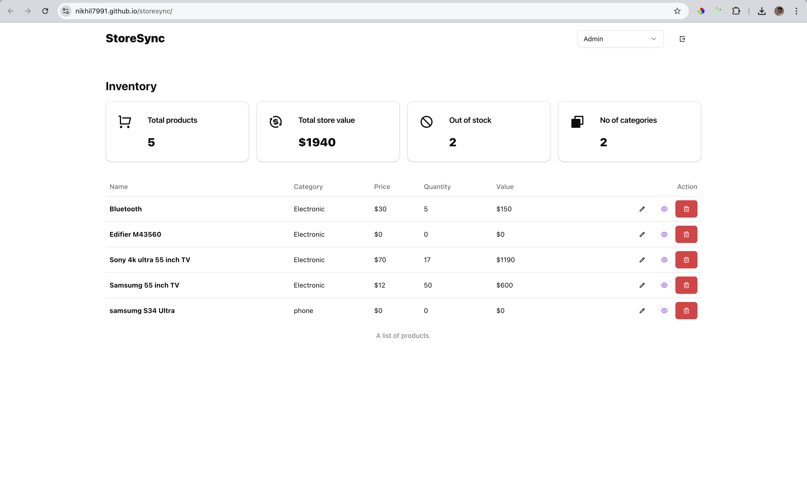

# StoreSync

A basic inventory management app

## Demo


## Screenshots



## Installation

Install storesync with pnpm (recommended)

```bash
  pnpm i
  pnpm run dev
```

Install storesync with npm

```bash
  npm i
  npm run dev
```

## Tech Stack

#### Built on the latest tech stack

```bash
React
Vite - Bundler
Redux - State management
RTK Query - Fetch/Caching API's
Tailwind - CSS framework
Shadcn ui - UI Library
Radix ui - Accessibility
eslint - Coding standard and consistency
```

## Build

To build this project run

```bash
  npm run build
```

## Authors

- [@nikhil7991](https://www.github.com/nikhil7991)
